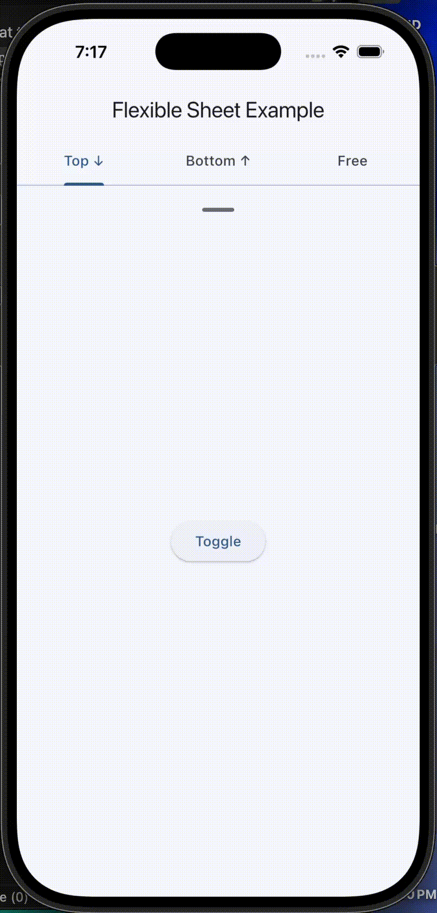

<!-- 

This README describes the package. If you publish this package to pub.dev,
this README's contents appear on the landing page for your package.

For information about how to write a good package README, see the guide for
[writing package pages](https://dart.dev/guides/libraries/writing-package-pages). 

For general information about developing packages, see the Dart guide for
[creating packages](https://dart.dev/guides/libraries/create-library-packages)
and the Flutter guide for
[developing packages and plugins](https://flutter.dev/developing-packages). 

commands :

dart doc
dart format .
flutter pub publish --dry-run
-->

# Flexible Sheet

A flexible, persistent sheet widget for Flutter that supports **top-to-bottom** and **bottom-to-top** directions with configurable snap behavior, spring physics, and programmatic control.

[](https://pub.dev/packages/flexible_sheet)

Need something else? Feel free to create issues, contribute, or request features on [GitHub](https://github.com/tempo-riz/persistent_top_sheet)!

## Features

- **Bidirectional** — slides from top or bottom (`SheetDirection.topToBottom` / `SheetDirection.bottomToTop`)
- **Snap behavior** — snap to edges or stay at the dragged position (`SheetSnapBehavior.snapToEdge` / `SheetSnapBehavior.freePosition`)
- **Customizable physics** — tune the spring animation via `SheetPhysics`
- **Programmatic control** — `open()`, `close()`, `toggle()`, `animateTo(height)` via `FlexibleSheetController`
- **Callbacks** — `onStateChanged`, `onHeightChanged`
- **Clean architecture** — separated enums, controller, physics, and widget

### Demo




## Getting Started

Add the package to your project:

```
flutter pub add flexible_sheet
```

Import it:

```dart
import 'package:flexible_sheet/flexible_sheet.dart';
```

## Usage

### Basic — Top Sheet (default)

```dart
final controller = FlexibleSheetController();

FlexibleSheet(
  maxHeight: 500,
  minHeight: 50,
  controller: controller,
  childBuilder: (height) => MyContent(height: height),
  handleBuilder: (height) => const MyHandle(),
  onStateChanged: (isOpen) => print('isOpen: $isOpen'),
);

// Programmatic control
controller.open();
controller.close();
controller.toggle();
controller.animateTo(250);
```

### Bottom Sheet

```dart
FlexibleSheet(
  maxHeight: 500,
  minHeight: 50,
  direction: SheetDirection.bottomToTop,
  controller: controller,
  childBuilder: (height) => MyContent(height: height),
  handleBuilder: (height) => const MyHandle(),
);
```

### Free Position (no snapping)

```dart
FlexibleSheet(
  maxHeight: 500,
  minHeight: 50,
  snapBehavior: SheetSnapBehavior.freePosition,
  childBuilder: (height) => MyContent(height: height),
  handleBuilder: (height) => const MyHandle(),
);
```

### Custom Physics

```dart
FlexibleSheet(
  maxHeight: 500,
  minHeight: 50,
  physics: SheetPhysics(
    spring: SpringDescription(mass: 1, stiffness: 600, damping: 35),
    defaultVelocity: 2000,
  ),
  childBuilder: (height) => MyContent(height: height),
  handleBuilder: (height) => const MyHandle(),
);
```

## API Reference

### `FlexibleSheet` Parameters

| Parameter | Type | Default | Description |
|---|---|---|---|
| `maxHeight` | `double` | **required** | Maximum sheet height |
| `minHeight` | `double` | **required** | Minimum sheet height |
| `childBuilder` | `Widget Function(double)` | **required** | Builds the content |
| `handleBuilder` | `Widget Function(double)?` | `null` | Builds the drag handle |
| `controller` | `FlexibleSheetController?` | `null` | Programmatic control |
| `direction` | `SheetDirection` | `topToBottom` | Slide direction |
| `snapBehavior` | `SheetSnapBehavior` | `snapToEdge` | Snap behavior on release |
| `physics` | `SheetPhysics?` | default physics | Spring animation config |
| `initialHeight` | `double?` | `minHeight` | Starting height |
| `isDraggable` | `bool` | `true` | Enable drag on handle |
| `onStateChanged` | `ValueChanged<bool>?` | `null` | Open/close callback |
| `onHeightChanged` | `ValueChanged<double>?` | `null` | Height change callback |
| `clipBehavior` | `Clip` | `Clip.hardEdge` | Content clip behavior |

### `FlexibleSheetController` Methods

| Method | Description |
|---|---|
| `open()` | Animate to max height |
| `close()` | Animate to min height |
| `toggle()` | Toggle between open/closed |
| `animateTo(double)` | Animate to a specific height |

### `FlexibleSheetController` Properties

| Property | Type | Description |
|---|---|---|
| `isOpen` | `bool` | Whether the sheet is open |
| `currentHeight` | `double` | Current sheet height |

## Migration from 1.x

```dart
// Before (1.x)
import 'package:persistent_top_sheet/persistent_top_sheet.dart';
final controller = PersistentTopSheetController();
PersistentTopSheet(
  maxHeight: 500, minHeight: 50,
  animationSpeed: 2000,
  controller: controller,
  childBuilder: (h) => ...,
  handleBuilder: (h) => ...,
);

// After (2.0)
import 'package:flexible_sheet/flexible_sheet.dart';
final controller = FlexibleSheetController();
FlexibleSheet(
  maxHeight: 500, minHeight: 50,
  physics: SheetPhysics(defaultVelocity: 2000),
  controller: controller,
  childBuilder: (h) => ...,
  handleBuilder: (h) => ...,
);
```

## Additional Information

There is a ready-to-use example in the `/example` folder.

Don't hesitate to ask for new features or contribute on [GitHub](https://github.com/tempo-riz/persistent_top_sheet)!

## Support

If you'd like to support this project, consider contributing [here](https://github.com/sponsors/tempo-riz). Thank you! :)